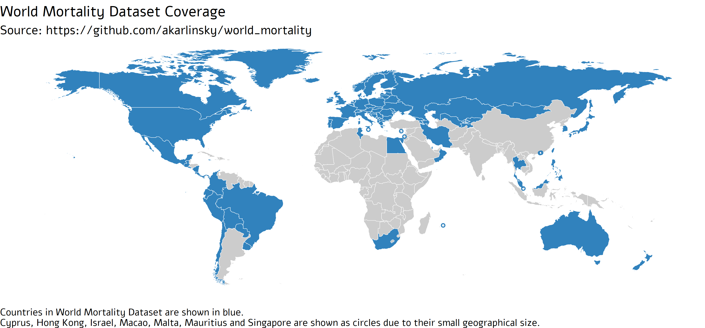

# World Mortality Dataset

This repository contains country-level data on all-cause mortality in 2015–2021 collected from various sources, see below. 
We are currently providing data for 79 countries. We welcome any contributions.

**Preprint:** Karlinsky & Kobak 2021, The World Mortality Dataset: Tracking excess mortality across countries during the COVID-19 pandemic, https://doi.org/10.1101/2021.01.27.21250604

For the excess mortality analysis using this data see https://github.com/dkobak/excess-mortality.

Notes:

* Our aim is to provide data from 2015 onwards. In some cases the coverage starts later, but we require at least full 2019 data.
* Countries are only included if the data exist until at least June 2020. 
* We only collect weekly, monthly, or quarterly data. 
* The latest data points (weeks/months/quarters) for each country are **preliminary** and subject to (sometimes large) revisions.   
* We only provide all-cause mortality numbers, without splitting by age or gender.
* We only provide country-level data, without splitting it by regions or individual cities.
* The Short Term Mortality Fluctuations (STMF) dataset from the [Human Mortality Database](https://www.mortality.org) (HMD) is integrated into this dataset. See the STMF dataset for mortality by age and gender; here we only provide the total numbers.
* The data for the European countries that are not in STMF are sourced from the [EuroStat](https://ec.europa.eu/eurostat/statistics-explained/index.php?title=Weekly_death_statistics&stable).
* Some countries publish obviously incomplete weekly data for most recent weeks, which shows as large "dips" in the end of the time series. We omit these data points for the following countries: Denmark, Finland, South Korea, United States. Note that some other countries may also report partially incomplete data.
* Weekly data mostly follow ISO8601 standard, when weeks are calendar weeks, Monday to Sunday, and the weeks on the year boundaries are assigned to the year in which they have more days (four or more). Most years have 52 weeks but some years, such as 2015 and 2020, have 53 weeks. Some countries follow other conventions, see e.g. [STMF description](https://www.mortality.org/Public/STMF_DOC/STMFNote.pdf).

## Sources

### Human Mortality Database, Short-Term Mortality Flucations
We collect the weekly STMF data for the following countries: Australia\*, Austria, Belgium, Bulgaria, Canada, Chile, Croatia, Czechia, Denmark, Estonia, Finland, France, Germany, Greece, Hungary, Iceland, Israel, Italy, Latvia, Lithuania, Luxembourg, Netherlands, New Zealand, Norway, Poland, Portugal, South Korea, Russia, Slovakia, Slovenia, Spain, Sweden†, Switzerland, United Kingdom (England & Wales + Northern Ireland†† + Scotland), United States.

We do not use Taiwan data from STMF because the monthly data (see below) is more frequently updated. 

United States data from 2017 onwards are replaced with CDC 'predictions' that account for underreporting in recent weeks (see below).

For some European countries, STMF sometimes has more up-to-date (and backward revised) data than Eurostat, as it culls data from countries' NSOs. 
For each data point that exists in both datasets, we take the maximum between them as the final data.

\* Australia's data (all years) is "Doctor Certified Deaths" rather than "All Registered Deaths". These constitute about 85%-90% of all deaths in Australia. 

† Sweden has a significant number of deaths which occurred in "unknown" week in all years. 960 deaths in 2015, 1963 in 2016, 2230 in 2017, 2513 in 2018, 2616 in 2019, 2652 in 2020. These are not included in the weekly data.  

†† Due to significant reporting delays in Norhtern Ireland data to STMF, we obtained weekly deaths data directly from [NISRA](https://www.nisra.gov.uk/publications/weekly-deaths). In order to harmonize with England & Wales and Scotland data, data was transformed to ISO-weeks by using the daily average for each week by date start and end. 

### Eurostat
We collect the weekly data from Eurostat for the following countries: Albania, Armenia, Cyprus, Georgia, Liechtenstein, Malta, Montenegro, Romania, Serbia. 

### Azerbaijan (monthly)
2015 to 2017: http://data.un.org/Data.aspx?d=POP&f=tableCode%3a65%3bcountryCode%3a31&c=2,3,6,8,10,12,13,14&s=_countryEnglishNameOrderBy:asc,refYear:desc,areaCode:asc&v=1  
2018: https://www.stat.gov.az/news/source/2019_12ay.zip   
2019 to 2020: https://www.stat.gov.az/news/source/2020_12ay.zip

### Belarus (monthly)
2015 to 2020: UNData - http://data.un.org/Data.aspx?d=POP&f=tableCode%3a65%3bcountryCode%3a112%3brefYear%3a2015%2c2016%2c2017%2c2018%2c2019%2c2020&c=2,3,6,8,10,12,13,14&s=_countryEnglishNameOrderBy:asc,refYear:desc,areaCode:asc&v=1

### Bolivia (monthly)
New York Times: https://github.com/nytimes/covid-19-data/tree/master/excess-deaths

NYT obtained these data directly from the Bolivian officials. Note that the data for April 2020 are missing. To quote NYT, "Bolivia’s Civil Registry recorded almost no deaths in April due to the closure of government offices during a lockdown. Officials said \[at\] least some of the deaths that occurred in April could have been registered in later months." In their analysis, NYT implicitly assumes that the excess mortality in April was zero.

### Bosnia (monthly)
Agency for Statistics of Bosnia & Herzegovina Natural Population Change Quarterly: http://www.bhas.ba/Calendar/Category/14#tab-releases

### Brazil (monthly)
2015 to 2017: UNData - http://data.un.org/Data.aspx?d=POP&f=tableCode%3a65%3bcountryCode%3a76%3brefYear%3a2015%2c2016%2c2017&c=2,3,6,8,10,12,13,14&s=_countryEnglishNameOrderBy:asc,refYear:desc,areaCode:asc&v=1  
2019 to 2020: Brazilian Population Registry: https://transparencia.registrocivil.org.br/registros

Note: The Brazilian Population Registry has data for monthly mortality in 2018, but it is significantly lower than UNData counts for previous years. This is possibly due to under-reporting in the Registry in early years. 
We chose not to include 2018 Brazilian currently. 

### Colombia (weekly)
https://www.dane.gov.co/index.php/estadisticas-por-tema/demografia-y-poblacion/informe-de-seguimiento-defunciones-por-covid-19  
Direct link to the latest table in Excel (January 2021): https://www.dane.gov.co/files/investigaciones/poblacion/defunciones-covid19/anexos-defunciones-covid-nal-2020-02mar-2021-17ene.xlsx 
Here we sum values in three categories: Natural, Violenta (Violent), and En estudio (unclassified deaths). 

### Costa Rica (monthly)
2015 to 2020: UNData - http://data.un.org/Data.aspx?d=POP&f=tableCode%3a65%3bcountryCode%3a188&c=2,3,6,8,10,12,13,14&s=_countryEnglishNameOrderBy:asc,refYear:desc,areaCode:asc&v=1  
2020: Costa Rica National Institute Of Statistics And Censuses (INEC) - Direct link to excel: https://www.inec.cr/sites/default/files/documetos-biblioteca-virtual/repoblacevdef_isem2020.xlsx  

The INEC publication provides mortality data for the first half (January-June) of 2020, While UNDATA provides monthly data for January-April. Our estimate for May and June mortality is thus the mean of the difference between the January-June total and the January-June mortality.   

### Ecuador (weekly)
2017: https://www.ecuadorencifras.gob.ec/nacimientos-y-defunciones-2017/  
2018: https://www.ecuadorencifras.gob.ec/category/poblacion-y-demografia/  
2019: https://www.ecuadorencifras.gob.ec/defunciones-generales-2019/  
2020: https://www.registrocivil.gob.ec/cifrasdefuncion/  
Direct link to the latest table in XLS (January 2021):  
https://www.registrocivil.gob.ec/wp-content/uploads/downloads/2021/01/Defunciones_Generales_2020_act_24_ENE_2021.xlsx

Ecuador provides daily death counts. We summed them up to form weekly death counts.

### Egypt (monthly)
2015 to 2019: http://data.un.org/Data.aspx?d=POP&f=tableCode%3a65%3bcountryCode%3a818&c=2,3,6,8,10,12,13,14&s=_countryEnglishNameOrderBy:asc,refYear:desc,areaCode:asc&v=1  
2020: Monthly Bulletin of the Egyptian NSO (CAPMAS): https://www.capmas.gov.eg/Pages/Publications.aspx?page_id=5107&Year=23518

### Hong Kong (monthly)
Hong Kong Census and Statistics Department:  
2015 to 2018: https://www.censtatd.gov.hk/hkstat/sub/sp160.jsp?productCode=FA100094    
2019 to 2020: Hong Kong Monthly Digest of Statistics, https://www.censtatd.gov.hk/hkstat/sub/sp110.jsp?productCode=B1010002

### Iran (quarterly)
Iran National Organization for Civil Registration: https://www.sabteahval.ir/avej/Page.aspx?mId=49826&ID=2182&Page=Magazines/SquareshowMagazine  
The data are provided in Solar Hirji seasons (Spring, Summer, Autumn, Winter). Winter starts on Dec 22, so we count it as the next calendar year (e.g. Winter 1393 as the first entry for 2015).

### Ireland (weekly)
2015 to 2019: New York Times: https://github.com/nytimes/covid-19-data/tree/master/excess-deaths  
[Based on a study by Ireland's Health Information and Quality (HIQA) Authority](https://www.hiqa.ie/sites/default/files/2020-07/Analysis-of-excess-all-cause-mortality-in-Ireland-during-the-COVID-19-epidemic.pdf)    
2020: Based on the methodology of the HIQA study, we crawled [RIP.IE](rip.ie) with [Gilad Gabiel's script](https://github.com/gaibelg/Death-Notices-Ireland) to provide weekly mortality counts for 2020 onwards.

### Japan (monthly)
Japanese Government Statistics Portal: https://www.e-stat.go.jp/stat-search/files?page=1&layout=datalist&toukei=00450011&kikan=00450&tstat=000001028897&cycle=1&tclass1=000001053058&tclass2=000001053059&tclass3val=0

### Kazakhstan (monthly)
Kazakhstan Bureau of National statistics Demographic Statistics: https://stat.gov.kz/official/industry/61/statistic/7

Direct link to Excel file: https://stat.gov.kz/api/getFile/?docId=ESTAT334793

### Kosovo (monthly)
Kosovo Agency of Statistics Quarterly Bulletin: https://ask.rks-gov.net/en/kosovo-agency-of-statistics/add-news/quarterly-bulletin-q4-2020  

### Kyrgyzstan (monthly)
2015 - 2018: UNData: http://data.un.org/Data.aspx?d=POP&f=tableCode%3a65%3bcountryCode%3a417&c=2,3,6,8,10,12,13,14&s=_countryEnglishNameOrderBy:asc,refYear:desc,areaCode:asc&v=1  
2019 onwards: National Statistical Committee of the Kyrgyz Republic - The main results of natural population January - November 2020: http://www.stat.kg/kg/statistics/naselenie/ 

### Macao (monthly)
2015 - 2019: UNData: http://data.un.org/Data.aspx?d=POP&f=tableCode:65;countryCode:446&c=2,3,6,8,10,12,13,14&s=_countryEnglishNameOrderBy:asc,refYear:desc,areaCode:asc&v=1

2020: Macao Special Administrative Region Statistics and Census Service Monthly Bulletin: https://www.dsec.gov.mo/en-US/Home/Publication/MonthlyBulletinOfStatistics

### Malaysia (quarterly)
Department of Statistics Malaysia:

2016: https://www.dosm.gov.my/v1/index.php?r=column/cthemeByCat&cat=430&bul_id=NHRXOUdiT0R0ZjZ0cy90elNUTHFsdz09&menu_id=L0pheU43NWJwRWVSZklWdzQ4TlhUUT09

2017 onward: https://www.dosm.gov.my/v1/index.php?r=column/cthemeByCat&cat=430&bul_id=YUttRnlGZ2VXSkg0M0F2ZHZFTE9IUT09&menu_id=L0pheU43NWJwRWVSZklWdzQ4TlhUUT09

### Mauritius (monthly)
2015 to 2019: UNData: http://data.un.org/Data.aspx?d=POP&f=tableCode%3a65%3bcountryCode%3a480&c=2,3,6,8,10,12,13,14&s=_countryEnglishNameOrderBy:asc,refYear:desc,areaCode:asc&v=1  

2020: Email correspondence with [Statistics Mauritius](https://statsmauritius.govmu.org/).

### Mexico (weekly)
Mexican Ministry of Health Excess deaths: https://coronavirus.gob.mx/exceso-de-mortalidad-en-mexico/

The Mexican Ministry of Health does not publish weekly data for years before 2020. Instead, the 2015--2018 data were used by the Mexican Ministry of Health to forecast expected weekly mortality. We denote this forecast as `year = 0` in the data.

### Moldova (monthly)
2015 to 2020: UNData: http://data.un.org/Data.aspx?d=POP&f=tableCode:65;countryCode:498&c=2,3,6,8,10,12,13,14&s=_countryEnglishNameOrderBy:asc,refYear:desc,areaCode:asc&v=1

2020: UNData MBS (as crude death rates): https://unstats.un.org/unsd/mbs/app/DataView.aspx?tid=3&cid=498&yearfrom=2015&yearto=2020&p=A  
Crude death rates were transformed to mortality counts by using the UNDATA Mid-Year Population estimate for Moldova 2020 which is 2,640,000. 

### Mongolia (monthly)
2015: UNData: http://data.un.org/Data.aspx?d=POP&f=tableCode%3a65%3bcountryCode%3a496%3brefYear%3a2015&c=2,3,6,8,10,12,13,14&s=_countryEnglishNameOrderBy:asc,refYear:desc,areaCode:asc&v=1

2016 to 2020: Mongolian Statistical Information Service: http://www.1212.mn/tables.aspx?tbl_id=DT_NSO_2100_027V2&SOUM_select_all=0&SOUMSingleSelect=_0&YearM_select_all=0&YearMSingleSelect=_202011_202010_202009_202008_202007_202006_202005_202004_202003_202002_202001_202012&viewtype=table

### North Macedonia (monthly)
2015 to 2019: UNData: http://data.un.org/Data.aspx?d=POP&f=tableCode%3a65%3bcountryCode%3a807&c=2,3,6,8,10,12,13,14&s=_countryEnglishNameOrderBy:asc,refYear:desc,areaCode:asc&v=1

2020: North Macedonia State Statistical Office Monthly Bulletin: https://www.stat.gov.mk/PrikaziPublikacija_1_en.aspx?rbr=823

### Oman (monthly)
Oman National Center for Statistics and Information
2015 to 2018: Deaths and Births Statistical Bulletin: https://www.ncsi.gov.om/Elibrary/Pages/LibraryContentDetails.aspx?ItemID=L61grnjbbbpxeUKErBemkg%3d%3d

2019 to 2020: Monthly Bulletin: https://www.ncsi.gov.om/Elibrary/Pages/LibraryContentDetails.aspx?ItemID=MgTlAFqddgBeormy3YBZDg%3d%3d

Note: 2019 monthly death counts was smaller at 1020 deaths than total yearly mortality count (Shown in the January 2021 Monthly Bulletin). 
In order to account for this, all 2019 monthly data was increased by the mean monthly difference of 85. Final official monthly data for 2019 should be available by November 2021. 

### Peru (weekly)
Peruvian Ministry of Health - National Deaths Registration System (SINADEF): https://www.minsa.gob.pe/reunis/data/defunciones_registradas.asp

Peru provides daily death counts. We summed them up to form weekly death counts.

### Philippines (monthly)
Philippines Statistics Authority: https://psa.gov.ph/vital-statistics/table

### Qatar (monthly)
2015 to 2019: UNData: http://data.un.org/Data.aspx?d=POP&f=tableCode:65;countryCode:634&c=2,3,6,8,10,12,13,14&s=_countryEnglishNameOrderBy:asc,refYear:desc,areaCode:asc&v=1

2020: Qatar Planning and Statistics Authority Monthly Statistics: https://www.psa.gov.qa/en/statistics1/pages/topicslisting.aspx?parent=General&child=QMS

### Russia (monthly)
https://www.fedstat.ru/indicator/33556 (data available from 2006)  
The latest month is published on *rosstat.gov.ru* first and it takes several days for the data to appear on *fedstat.ru*. The exact URL is always different. For November 2020, the URL is https://rosstat.gov.ru/storage/mediabank/ldMWepjj/edn11-2020.htm.

### San Marino (monthly)
San Marino Office of Economc Planning, Data Processing and Statistics - Bulletin of Statistics:   https://www.statistica.sm/on-line/en/home/publications/bulletin-of-statistics.html

### Singapore (monthly)
Department of Statistics Singapore: https://www.tablebuilder.singstat.gov.sg/publicfacing/createDataTable.action?refId=15167

### South Africa (weekly)
South Africa Medical Research Council (SAMRC): https://www.samrc.ac.za/reports/report-weekly-deaths-south-africa

South African data is provided in an Epidemiological Week format, which run from Sunday to Saturday. 

SAMRC does not publish weekly data for years before 2020. Instead, the 2018--2019 data were used by SAMRC to forecast expected weekly mortality using the Excel `Holt-Winters` time series forecasting method in Excel function. We denote this forecast as `year = 0` in the data.

For additional details, refer to SAMRC (2021): METHODOLOGICAL NOTE: PREDICTED NUMBERS OF DEATHS BY EPI-WEEK FOR SOUTH AFRICA IN 2020 AND 2021, available at: https://www.samrc.ac.za/sites/default/files/files/2021-01-24/Methodological%20Note%20on%20Predicted%20Weekly%20Deaths%2020_Jan_2021.pdf  

### Taiwan (monthly)
Taiwan Ministry of the Interior Monthly Bulletin of Interior Statistics: https://www.moi.gov.tw/files/site_stuff/321/1/month/month_en.html

Taiwan also has weekly data from STMF, but it is less updated, so we opted to keep the monthly data for now.

### Uruguay
[Uruguay Ministry of Public Health - Surveillance of all-cause mortality](https://www.gub.uy/ministerio-salud-publica/comunicacion/noticias/vigilancia-mortalidad-todas-causas).   
The report presents weekly deaths in 2020 and a forecast of expected deaths based on the median of weekly deaths in 2015-2019 up to week 30. 
The data from the report's figure 3 was digitized using [WebPlotDigitizer](https://github.com/ankitrohatgi/WebPlotDigitizer). 

We denote this forecast as `year = 0` in the data.

### Thailand (monthly)
Official Statistics Registration Systems:
https://stat.bora.dopa.go.th/stat/statnew/statMenu/newStat/home.php

### Ukraine (monthly)
2015 to 2018: http://data.un.org/Data.aspx?d=POP&f=tableCode%3a65%3bcountryCode%3a804&c=2,3,6,8,10,12,13,14&s=_countryEnglishNameOrderBy:asc,refYear:desc,areaCode:asc&v=1

2020: State Statistics Office of Ukraine: http://www.ukrstat.gov.ua/  
Access by: Statistical Information -> Population and migration -> Number of live births, deaths, by region

2019 data can be found following links from: http://www.ukrstat.gov.ua/express/expr2020/expres_2020.html

### Uzbekistan (monthly)
2015 to 2018: UNData: http://data.un.org/Data.aspx?d=POP&f=tableCode%3a65%3bcountryCode%3a860&c=2,3,6,8,10,12,13,14&s=_countryEnglishNameOrderBy:asc,refYear:desc,areaCode:asc&v=1

2019 to 2020: Uzbekistan State Committee on Statistics - Demographic situation January - December (Direct link to PDF): https://www.stat.uz/images/uploads/docs/demografiya_uz_18012021.pdf

### United States (weekly)
2015--2016: STMF, see above.  
From 2017: Centers for Disease Control and Prevention: https://data.cdc.gov/api/views/xkkf-xrst/rows.csv  
We use the 'predicted' (weighted) time series that accounts for underreporting in recent weeks. See https://www.cdc.gov/nchs/nvss/vsrr/covid19/excess_deaths.htm for more information.  
We remove the last weeks (usually two) that are marked at https://gis.cdc.gov/grasp/fluview/mortality.html as being <90% complete.

----------------------------

## Currently unused sources

Below are listed some sources that are currently *not* used for this dataset.

### Armenia (monthly)

The monthly numbers for Armenia are not used because we prefer the weekly numbers from EuroStat.

2015: https://www.armstat.am/file/article/sv_12_15r_520.pdf  
2016: https://www.armstat.am/file/article/sv_12_16r_520.pdf  
2017: https://www.armstat.am/file/article/sv_12_17r_520.pdf  
2018: https://www.armstat.am/file/article/sv_12_18r_520.pdf  
2019: https://www.armstat.am/file/article/sv_12_19r_520.pdf  
2020: https://www.armstat.am/file/article/sv_10_20r_520.pdf  

### Georgia (monthly)

The monthly numbers for Georgia are not used because we prefer the weekly numbers from EuroStat.

2015--19: https://www.geostat.ge/media/34261/დემოგრაფიული-ვითარება-საქართველოში-2019.pdf, page 67  
2020: https://www.kavkaz-uzel.eu/blogs/83781/posts/45084 (values digitized from an official plot)

### Ireland (quarterly)
Ireland Central Statistics Office: https://data.cso.ie/table/VSQ01

### Romania (monthly)

The monthly numbers for Romania are not used because we prefer the weekly numbers from EuroStat.

National Institute of Statistics: 
https://insse.ro/cms/en/comunicate-de-presa-view?field_categorie_value_i18n%5B%5D=15&created=8&field_cuvinte_cheie_value=&items_per_page=10

### Serbia (monthly)

The monthly numbers for Serbia are not used because we prefer the weekly numbers from EuroStat.

Statistical Office of the Republic of Serbia: https://www.stat.gov.rs/en-us/oblasti/stanovnistvo/rodjeni-i-umrli/

### Tunisia (monthly)

Tunisia data for 2020 appear incomplete. We do not include it for now.

Tunisia National Institute of statistics Monthly Bulletin: http://www.ins.tn/en/publication/statistics-monthly-bulletin-november-2020
