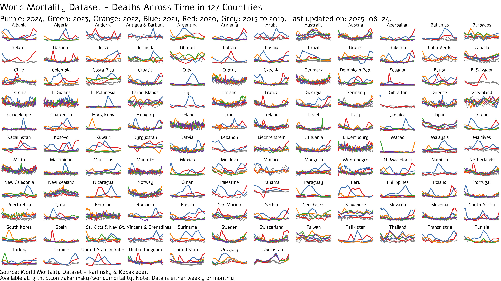

# World Mortality Dataset

This repository contains country-level data on all-cause mortality in 2015–2024 collected from various sources, see below.\
We are currently providing data for 127 countries and territories.\
We welcome any contributions.

If you use this data, please cite it as:\
Karlinsky & Kobak 2021, Tracking excess mortality across countries during the COVID-19 pandemic with the World Mortality Dataset, *eLife* <https://doi.org/10.7554/eLife.69336>

For the excess mortality analysis using this data see <https://github.com/dkobak/excess-mortality>.

For our sister-project of sub-national mortality data, see <https://github.com/akarlinsky/world_mortality/tree/main/local_mortality>

Notes:
-   We will not provide any excess mortality estimates starting from 2024. Our excess mortality calculations are based on linear extrapolation of 2015--2019 trends, and this becomes more and more tenuous as the years go by. We will continue to provide and update data for 2024 and beyond, but [excess mortality estimates](https://github.com/dkobak/excess-mortality) will only be avilable up to end of 2023.
-   Our aim is to provide data from 2015 onward. In some cases the coverage starts later, but we require at least full 2019 data.
-   Countries are only included if the data exist until at least June 2020.
-   We only collect weekly, monthly, or quarterly data.
-   The latest data points (weeks/months) for each country are **preliminary** and subject to (sometimes large) revisions.
-   We only provide all-cause mortality numbers, without splitting by age or gender.
-   We only provide country-level data, without splitting it by regions or individual cities.
-   The Short Term Mortality Fluctuations (STMF) dataset from the [Human Mortality Database](https://www.mortality.org/Data/STMF) (HMD) is integrated into this dataset. See the STMF dataset for mortality by age and gender; here we only provide the total numbers.
-   The data for the European countries that are not in STMF are sourced from the [EuroStat](https://ec.europa.eu/eurostat/statistics-explained/index.php?title=Weekly_death_statistics&stable).
-   Some countries publish obviously incomplete weekly data for most recent weeks, which shows as large "dips" in the end of the time series. We omit these data points.\
-   Weekly data mostly follow ISO8601 standard, when weeks are calendar weeks, Monday to Sunday, and the weeks on the year boundaries are assigned to the year in which they have more days (four or more). Most years have 52 weeks but some years, such as 2015 and 2020, have 53 weeks. Some countries follow other conventions, see e.g. [STMF description](https://www.mortality.org/Public/STMF_DOC/STMFNote.pdf).

## Sources

### Human Mortality Database, Short-Term Mortality Fluctuations

We collect the weekly [STMF data](https://mpidr.shinyapps.io/stmortality/) for the following countries: Austria, Belgium, Bulgaria, Chile, Croatia, Czechia, Denmark, Estonia, Finland, France, Germany, Greece, Hungary, Iceland, Italy, Latvia, Lithuania, Luxembourg, Netherlands, New Zealand, Norway, Poland, Portugal, South Korea, Slovakia, Slovenia, Spain, Switzerland, United Kingdom (England & Wales + Northern Ireland + Scotland).

We do not use Taiwan data from STMF because the monthly data (see below) is more frequently updated.

For some European countries, STMF sometimes has more up-to-date (and backward revised) data than EuroStat, as it culls data from countries' NSOs. We harmonize the data between these two sources by defaulting to STMF wherever possible, and appending additional from Eurostat if available.

### Eurostat

We collect the weekly data from Eurostat for the following countries: Cyprus, Malta, Montenegro, Romania: <https://ec.europa.eu/eurostat/databrowser/view/demo_r_mwk_ts/default/table?lang=en>

Additionally, we collect weekly data from EuroStat for the five French Overseas Departments: French Guiana, Guadeloupe, Martinique, Mayotte, Réunion: <https://ec.europa.eu/eurostat/databrowser/view/demo_r_mwk2_ts/default/table?lang=en>

### Albania (monthly)

2016 to 2018: UNData: <http://data.un.org/Data.aspx?d=POP&f=tableCode:65;countryCode:8&c=2,3,6,8,10,12,13,14&s=_countryEnglishNameOrderBy:asc,refYear:desc,areaCode:asc&v=1>

2015, 2019 onward: Email correspondence with [Albania Institute of Statistics](http://www.instat.gov.al/en/).

### Algeria (monthly)

2018 to 2020: Office National des Statistiques [Démographie Algérienne](https://www.ons.dz/spip.php?rubrique182).

2018-2019 values were digitized using [WebPlotDigitizer](https://github.com/ankitrohatgi/WebPlotDigitizer). These are shown with one significant digit to emphasize this.

### Andorra (monthly)

2015 to 2021: Email correspondence with [Andorra Department of Statistics](https://www.estadistica.ad/serveiestudis/web/index.asp?lang=1).

See publication on Natural Movement: <https://www.estadistica.ad/serveiestudis/noticies/noticia5913cat.pdf>

### Antigua and Barbuda (monthly)

2015 onward: [Statistics Division of Antigua and Barbuda: Deaths by month and sex 2008 to 2020](https://statistics.gov.ag/subjects/population-and-demography/deaths-by-month-and-sex-2008-2020/)

### Argentina (monthly)

2015 to 2022: [Argentina Ministry of Health: Monthly General Deaths occurred and registered in the Argentine Republic](http://datos.salud.gob.ar/dataset/datos-salud-gob-ar-dataset-defunciones-mensuales-ocurridas-en-la-republica-argentina).

Notes: (1) December 2022 deaths are low due to registration in 2023. We have adjusted it to match 2022 total from the [2022 vital statistics report](https://www.argentina.gob.ar/salud/deis).\
(2) All years except 2016 and 2022 record some deaths in unknown month (from 3 in 2017 to 782 in 2019). These were distributed uniformly across months.

### Armenia (monthly)

[Statistical Committee of the Republic of Armenia](https://www.armstat.am/):

2015: <https://www.armstat.am/file/article/sv_12_15r_520.pdf>\
2016: <https://www.armstat.am/file/article/sv_12_16r_520.pdf>\
2017: <https://www.armstat.am/file/article/sv_12_17r_520.pdf>\
2018: <https://www.armstat.am/file/article/sv_12_18r_520.pdf>\
2019: <https://www.armstat.am/file/article/sv_12_19r_520.pdf>\
2020: <https://www.armstat.am/file/article/sv_12_20r_520.pdf>\
2021: <https://www.armstat.am/file/article/sv_04_21r_510.pdf>

### Aruba (monthly)

2015 - 2020: Aruba Central Bureau Of Statistics Quarterly Demographic Bulletin 2020: <https://cbs.aw/wp/index.php/2020/12/17/quarterly-demographic-bulletin-2019-2/>

2021: [Monthly deaths data](https://www.facebook.com/permalink.php?story_fbid=2005136112986868&id=143358652497966) was digitized using [WebPlotDigitizer](https://github.com/ankitrohatgi/WebPlotDigitizer)

### Australia (weekly)

2015 onward: Australian Bureau of Statistics (ABS) - [Provisional Mortality Statistics](https://www.abs.gov.au/statistics/health/causes-death/provisional-mortality-statistics/latest-release).

On April 28th 2022, ABS released weekly data as all deaths (doctor + coroner), such that a correction is no longer needed. WMD now reports and analyzes total deaths for Australia.

### Azerbaijan (monthly)

2015: <https://www.stat.gov.az/news/source/2016_01ay.zip> <https://unstats.un.org/unsd/mbs/app/DataView.aspx?tid=3&cid=31&yearfrom=2015&yearto=2015&p=A>\
2016 to 2017: <http://data.un.org/Data.aspx?d=POP&f=tableCode%3a65%3bcountryCode%3a31&c=2,3,6,8,10,12,13,14&s=_countryEnglishNameOrderBy:asc,refYear:desc,areaCode:asc&v=1>\
2018: <https://www.stat.gov.az/news/source/2019_12ay.zip>\
2019-2020: <https://www.stat.gov.az/news/source/2021_1ay.zip>\
2021 onward: <https://www.stat.gov.az/news/macroeconomy.php>

Note: data in 2015 was given in thousands so it is expressed as integers. The total annual deaths from the monthly counts is 54,700 while the true annual total is 53,697 so we do not adjust further.

### Bahamas (monthly)

2015 onward: Email correspondence with [Bahamas National Statistical Institute](https://stats.gov.bs/).

### Barbados (monthly)

2015 onward: Email correspondence with [Barbados Statistical Service (BSS)](https://stats.gov.bb/).

Note: The data we obtained from BSS listed 0 deaths for September 2017 and April 2018. We used the [annual amount of deaths registered](https://stats.gov.bb/subjects/social-demographic-statistics/population-demography-statistics/) to impute these missing values.

### Belarus (monthly)

2015 to 2020: UNData - <http://data.un.org/Data.aspx?d=POP&f=tableCode%3a65%3bcountryCode%3a112%3brefYear%3a2015%2c2016%2c2017%2c2018%2c2019%2c2020&c=2,3,6,8,10,12,13,14&s=_countryEnglishNameOrderBy:asc,refYear:desc,areaCode:asc&v=1>

July 2020 to March 2021: <https://www.currenttime.tv/a/smertnost-v-belarusi/31401342.html>

### Belize (monthly)

2015 onward: Email correspondence with [Belize Ministry of Health and Wellness](https://www.health.gov.bz/).

### Bermuda (monthly)

2015 to 2018: <http://data.un.org/Data.aspx?d=POP&f=tableCode%3a65%3bcountryCode%3a60&c=2,3,6,8,10,12,13,14&s=_countryEnglishNameOrderBy:asc,refYear:desc,areaCode:asc&v=1>

2019 to 2020: Email correspondence with [Bermuda Department of Statistics](https://www.gov.bm/department/statistics).

### Bhutan (monthly)

2019 onward: [Bhutan National Statistics Bureau Vital Statistics Reports](https://www.nsb.gov.bt/publications/vital-statistics/)

### Bolivia (monthly)

2015 onward: Information obtained from The Bolivian Civil Registry - [Servicio de Registro Cívico (SERECI)](https://www.oep.org.bo/registro-civico/) by [G. J. Andrés Uzín P. & Luis Salas from Bolivian Private University](https://www.upb.edu/es/contenido/seguimiento-las-muertes-en-exceso-y-muertes-por-covid-19)

Monthly numbers were corrected to total annual deaths from the national statistics office - [Instituto Nacional de Estadística (INE) Registros Administrativos](https://www.ine.gob.bo/index.php/registros-administrativos-sociales/).

### Bosnia (monthly)

2015 to 2016: Email correspondence with [Agency for Statistics of Bosnia & Herzegovina (BHAS)](http://www.bhas.ba/Home/).

2017 onward: BHAS Natural Population Change Quarterly: <http://www.bhas.ba/Calendar/Category/14#tab-releases>

### Brazil (monthly)

2015 to 2023: Brazil Ministry of Health Sistema de Informação sobre Mortalidade (SIM): <https://opendatasus.saude.gov.br/dataset/sim>

2024 January onward: Brazilian Civil Registry (RC): <https://transparencia.registrocivil.org.br/registros>\
In Brazil, the RC is the most up to date source of all-cause mortality. However, it is downward biased compared to the official final figures from SIM due to delayed registration. In order to account for this, the monthly counts from the RC are corrected using the ratio between total deaths in SIM 2022 (1,544,266) to total deaths in RC 2022 (1,503,262).

Monthly deaths in Brazil that have been corrected for delayed registration were rounded to one significant digit to emphasize they were adjusted. When comprehensive SIM data is available, no correction is conducted.

We thank [Marcelo Oliveira](https://github.com/capyvara) and [Otavio Ranzani](https://github.com/oranzani/) for their help on this.

### Brunei (monthly)

2015 onward: [Department of Economic Planning and Statistics - Vital Statistics](http://www.deps.gov.bn/SitePages/Vital%20Statistics.aspx)

### Cabo Verde (monthly)

2015 onward: [National Institute of Statistics - Vital Statistics](https://ine.cv/publicacoes/estatisticas-vitais-nascimentos-obitos-casamentos-2019-2020/)

### Canada (weekly)

StatCan - <https://www150.statcan.gc.ca/n1/pub/71-607-x/71-607-x2024004-eng.htm>

Weekly mortality counts were transformed to ISO-8601 weeks by using reference date.

### Colombia (weekly)

Colombia Health Dashboard: <https://experience.arcgis.com/experience/d9bfa6a650a249099b5f290a6c454804/?draft=true>

Queried from <https://github.com/sociedatos>.

### Costa Rica (monthly)

2015 to 2019: UNData - <http://data.un.org/Data.aspx?d=POP&f=tableCode%3a65%3bcountryCode%3a188&c=2,3,6,8,10,12,13,14&s=_countryEnglishNameOrderBy:asc,refYear:desc,areaCode:asc&v=1>

2020 onward: Costa Rica Instituto Nacional De Estadística Y Censos (INEC) Defunciones 2020, el impacto de la enfermedad COVID-19 - DATOS PRELIMINARES: <https://www.inec.cr/sites/default/files/documetos-biblioteca-virtual/repoblacdef2020covid-19preliminar.pdf>

### Cuba (monthly)

2015 onward: Oficina Nacional de Estadistica e Informacion (ONEI) [Anuario Demográfico 2020](http://www.onei.gob.cu/node/16425)

### Dominican Republic (monthly)

2015 onward: Oficina Nacional de Estadística (ONE) [Estadísticas Vitales - Defunciones](https://one.gob.do/datos-y-estadisticas/temas/estadisticas-demograficas/estadisticas-vitales/)

Note: ONE has information on deaths up to end of 2023, yet deaths in the Dominican Republic have a some delay in registration, especially in the last months of the year, where deaths will only be registered in the next year in ordinary times, a delay that COVID-19 might have increased. Thus, we are currently only displaying data up to October 2023.

### Ecuador (weekly)

2015 to 2016: <https://aplicaciones3.ecuadorencifras.gob.ec/BIINEC-war/index.xhtml>\
2017: <https://www.ecuadorencifras.gob.ec/nacimientos-y-defunciones-2017/>\
2018: <https://www.ecuadorencifras.gob.ec/category/poblacion-y-demografia/>\
2019: <https://www.ecuadorencifras.gob.ec/defunciones-generales-2019/>\
2020 onward: <https://www.registrocivil.gob.ec/registro-civil-cifras-defunciones-3/>

Ecuador provides daily death counts. We summed them up to form weekly death counts.

We thank [Andrés N. Robalino](https://github.com/andrab/ecuacovid) for providing us with 2015-2016 data.

### Egypt (monthly)

2015 to 2019: <http://data.un.org/Data.aspx?d=POP&f=tableCode%3a65%3bcountryCode%3a818&c=2,3,6,8,10,12,13,14&s=_countryEnglishNameOrderBy:asc,refYear:desc,areaCode:asc&v=1>

2020 onward: Monthly Bulletin of the Egyptian NSO (CAPMAS): <https://www.capmas.gov.eg/Pages/Publications.aspx?page_id=5107&Year=23518> & Egypt in Figures 2021 - Vital: <https://www.capmas.gov.eg/Pages/Publications.aspx?page_id=5104&Year=23595> & Statistics: It is expected that the population of Egypt: <https://www.capmas.gov.eg/Pages/GeneralNews.aspx?page_id=1>.

2021: Egypt in Figures 2022 - Vital: <https://www.capmas.gov.eg/Pages/StaticPages.aspx?page_id=5035>.

### El Salvador (monthly)

2015 to 2020: Public Information Request by [LAB-DAT](https://lab-dat.com/) from [RNPN](https://www.rnpn.gob.sv/).

### Faroe Islands (monthly)

2015 onward: [Statistics Faroe Islands](https://hagstova.fo/en/population/births-and-deaths/deaths).

### Fiji (monthly)

2015 onward: [Republic of Fiji Vital Statistics Report](https://www.statsfiji.gov.fj/statistics/social-statistics/vital-statistics-report.html) digitized using [WebPlotDigitizer](https://github.com/ankitrohatgi/WebPlotDigitizer).

Note: Fiji's vital stats report provides mean 2015-2019 (denoted as year 0 here) and 2020, 2021. It also includes annual counts. The digitized values were scaled to match the annual totals.

### French Polynesia (monthly)

2015 to 2020: Email correspondence with [Institut de la Statistique de la Polynésie Française (ISPF)](https://www.ispf.pf/).

2021 onward: [ISPF Les dernières publications - Bilan démographique 2021](https://www.ispf.pf/publication/1325).

### Georgia (monthly)

2015-2020: Georgia National Office of Statistics (GEOSTAT): <https://www.geostat.ge/en/modules/categories/320/deaths>

Access by: Number of Deaths Per Month -\> Download XLS file.

2021: [SUMMARY VITAL STATISTICS 2021 JANUARY-JUNE (PRELIMINARY RESULTS)](https://www.geostat.ge/en/single-news/2329/summary-vital-statistics-2021-january-june-preliminary-results)

### Gibraltar (monthly)

2015 onward: Gibraltar Broadcasting Corporation (GBC) public request from Government of Gibraltar Press Office <https://www.gbc.gi/news/187-increase-deaths-january-compared-10-year-average>

### Greenland (monthly)

2015-2019: Statistics Greenland StatBank Deaths (monthly): <https://bank.stat.gl/pxweb/en/Greenland/Greenland__BE__BE10__BE20/BEXBBDMD1.PX/>

2020 onward: Statistics Greenland StatBank Deaths (monthly, quarterly update): <https://bank.stat.gl:443/sq/ace5d79c-0f75-41fc-a705-609506ca25e3?lang=en&select>

### Guatemala (weekly)

2015-2021: Guatemala Instituto Nacional de Estadística (INE) Estadísticas Vitales <https://www.ine.gob.gt/ine/vitales/> Access by: Base de datos, select appropriate year under Año and then select Defunciones.

2022: Public Information Request from [RENAP](https://www.renap.gob.gt/solicitud-de-informacion-publica-decreto-57-2008).

### Hong Kong (monthly)

Hong Kong Census and Statistics Department:\
2015 to 2018: <https://www.censtatd.gov.hk/hkstat/sub/sp160.jsp?productCode=FA100094>\
2019 onward: Hong Kong Monthly Digest of Statistics, <https://www.censtatd.gov.hk/hkstat/sub/sp110.jsp?productCode=B1010002>

On June 2nd, 2021 - We obtained monthly number of deaths in Hong Kong by month of occurrence rather than month of registration, via an email correspondence with [Hong Kong Census and Statistics Department](http://censtatd.gov.hk/).

### Iran (weekly)

2015 onward: [Weekly deaths data (Persian Calendar ISO Weeks)](https://www.sabteahval.ir/avej/Page.aspx?mId=49826&ID=3273&Page=Magazines/SquareshowMagazine) transformed to average daily, then aggregated to ISO 8601 weeks.

### Ireland (weekly)

2015 - 2021: Ireland Central Statistics Office (CSO) - Vital Statistics Annual Reports: <https://data.cso.ie/table/VSD39>. Ireland provides daily death counts. We summed them up to form weekly death counts.

2022 onward: Ireland Central Statistics Office (CSO) - weekly data based on the web-scarped series from rip.ie as available from [Eurostat](https://ec.europa.eu/eurostat/databrowser/view/demo_r_mwk_ts) (See [Measuring Mortality Using Public Data Sources](https://data.cso.ie/table/RIP02)).

Note that figures from rip.ie are preliminary and might change.

### Israel (weekly)

2015 onward: Israeli Central Bureau of Statistics: <https://www.cbs.gov.il/he/subjects/Pages/%D7%AA%D7%9E%D7%95%D7%AA%D7%94-%D7%95%D7%AA%D7%95%D7%97%D7%9C%D7%AA-%D7%97%D7%99%D7%99%D7%9D.aspx>

### Jamaica (monthly)

2015 onward: Statistical Institute of Jamaica [Registered Deaths by Month of Registration](https://statinja.gov.jm/Demo_SocialStats/newbirthdeathmarriage.aspx)

Monthly numbers were corrected to total annual deaths from the above link at section "Components of Annual Population Growth".

### Japan (monthly)

2015 onward: Japanese Government Statistics Portal: <https://www.e-stat.go.jp/stat-search/files?page=1&layout=datalist&toukei=00450011&kikan=00450&tstat=000001028897&cycle=1&tclass1=000001053058&tclass2=000001053059&tclass3val=0>

### Jordan (monthly)

2015, 2017 onward: [Jordan Civil Status and Passports Department - Annual Report](https://www.cspd.gov.jo/Ar/List/%D8%A7%D9%84%D8%AA%D9%82%D8%A7%D8%B1%D9%8A%D8%B1_%D8%A7%D9%84%D8%B3%D9%86%D9%88%D9%8A%D8%A9).

### Kazakhstan (monthly)

Kazakhstan Bureau of National Statistics 2015 to 2018: Monthly Socio-Economic Development of the Republic of Kazakhstan: <https://stat.gov.kz/edition/publication/month?lang=en>

2019 - 2022: <https://stat.gov.kz/official/industry/61/statistic/7>

2023 onward: <https://stat.gov.kz/industries/social-statistics/demography/dynamic-tables/>

Thanks to Noah Katz for culling Kazakhstan's data 2015 to 2018.

Thanks to [Mikhail Zelenskiy](https://twitter.com/Zforever) for filling the gaps in 2016 and 2017.

### Kosovo (monthly)

2015 - 2019: [Statistical Yearbook of the Republic of Kosovo](https://ask.rks-gov.net/sq/agjencia-e-statistikave-te-kosoves/add-news/vjetari-statistikor-i-republikes-se-kosoves-2021)

2020: [Death Statistics 2020](https://ask.rks-gov.net/media/6529/vdekjet-2020-vjetore.pdf)

2021 - 2022: [Deaths by place of death and place of permanents residence in the municipality](https://askdata.rks-gov.net/PXWeb/pxweb/en/askdata/askdata__09%20Population__Demography%20and%20Migration__Monthly%20indicators__Births,%20deaths,%20marriages%20and%20divorces/tab03.px/?rxid=02560921-b63c-4973-81c9-4ceae84f5b04)

2023 Onward: <https://askdata.rks-gov.net/pxweb/en/ASKdata/ASKdata__Population__Births%20and%20deaths__Mortality__Monthly%20indicators/tab03.px/>

Note: Since 2020, Kosovo's NSO has released monthly mortality data disaggregated by place of death, with a substantial share occurring outside Kosovo due to a large diaspora. Data from previous years is for deaths that occur in Kosovo only. Thus, for consistency - all values are for deaths that occur in Kosovo.

We thank [Dren Morina](https://github.com/Nerdm) for his help on this.

### Kuwait (monthly)

2015 onward: Kuwait Central Statistical Bureau [Annual Bulletin For Vital Statistics Births and Deaths](https://www.csb.gov.kw/Pages/Statistics_en?ID=10&ParentCatID=%201).

### Kyrgyzstan (monthly)

2015 - 2018: UNData: <http://data.un.org/Data.aspx?d=POP&f=tableCode%3a65%3bcountryCode%3a417&c=2,3,6,8,10,12,13,14&s=_countryEnglishNameOrderBy:asc,refYear:desc,areaCode:asc&v=1>\
2019 onward: National Statistical Committee of the Kyrgyz Republic - The main results of natural population January - December 2020: <http://www.stat.kg/kg/statistics/naselenie/>

### Lebanon (monthly)

2015 - 2019: [Lebanon Ministry of Public Health Vital Statstics Bulletin Bulletin](https://www.moph.gov.lb/en/Pages/8/327/statistical-bulletins#/en/Pages/8/327/statistical-bulletins)

2017 - 2021: [Lebanon Ministry of Public Health Hospital-based Cause Of Death Notification System](https://www.moph.gov.lb/en/Pages/8/327/statistical-bulletins#/en/Pages/8/20380/hospital-based-cause-of-death-statistics)

Monthly hospital deaths (2020 onward) have been corrected to total deaths using the ratio between total deaths (available [here](https://www.moph.gov.lb/en/Pages/8/327/statistical-bulletins#/en/Pages/8/138/health-indicators)) to hospital deaths.

### Liechtenstein (monthly)

2015 - 2021: Liechtenstein Office for Statistics: <https://www.llv.li/inhalt/118804/amtsstellen/sonderseite-covid-19>

2022 onwards: [EuroStat Deaths by Month](https://ec.europa.eu/eurostat/databrowser/bookmark/8ac2a264-1a4c-4c36-9c16-991686b4a279?lang=en)

### Macao (monthly)

2015 - 2019: UNData: <http://data.un.org/Data.aspx?d=POP&f=tableCode:65;countryCode:446&c=2,3,6,8,10,12,13,14&s=_countryEnglishNameOrderBy:asc,refYear:desc,areaCode:asc&v=1>

2020 onward: Macao Special Administrative Region Statistics and Census Service Monthly Bulletin: <https://www.dsec.gov.mo/en-US/Home/Publication/MonthlyBulletinOfStatistics>

### Malaysia (monthly)

Department of Statistics Malaysia:

2015 to 2019: eStatistik: <https://newss.statistics.gov.my/newss-portalx/ep/epProductFreeDownloadSearch.seam>

Access by selecting: Main Category - Social, Sub-Category - Demography. Publication title is "Vital Statistics Malaysia".

2020 onward: Demographic Statistics Quarterly 2020: <https://www.dosm.gov.my/v1/index.php?r=column/ctwoByCat&parent_id=115&menu_id=L0pheU43NWJwRWVSZklWdzQ4TlhUUT09>

### Mauritius (monthly)

2015 to 2019: UNData: <http://data.un.org/Data.aspx?d=POP&f=tableCode%3a65%3bcountryCode%3a480&c=2,3,6,8,10,12,13,14&s=_countryEnglishNameOrderBy:asc,refYear:desc,areaCode:asc&v=1>

2020 onward: Email correspondence with [Statistics Mauritius](https://statsmauritius.govmu.org/).

### Mexico (weekly)

National Institute of Statistics, Geography and Informatics (INEGI) Mexico: 2015 - 2019: <https://www.inegi.org.mx/programas/mortalidad/#Datos_abiertos>

Mexican Ministry of Health Excess deaths database: 2020 onward: <http://www.dgis.salud.gob.mx/contenidos/basesdedatos/da_exceso_mortalidad_mexico_gobmx.html> and <https://coronavirus.gob.mx/exceso-de-mortalidad-en-mexico/>

We wish to thank [Mario Romero Zavala](https://github.com/mariorz) & [Laurianne Despeghel](https://github.com/lauriannedsp) for helping us obtain this information.

### Moldova (monthly)

2015 to 2019: UNData: <http://data.un.org/Data.aspx?d=POP&f=tableCode:65;countryCode:498&c=2,3,6,8,10,12,13,14&s=_countryEnglishNameOrderBy:asc,refYear:desc,areaCode:asc&v=1>

2020: Moldova National Bureau of Statistics Quarterly Statistical Bulletin: <https://statistica.gov.md/newsview.php?l=en&idc=30&id=6945&parent=0>

### Monaco (monthly)

2015 to 2019: Email correspondence with [Monegasque Institute of Statistics and Economic Studies (IMSEE)](https://www.imsee.mc/).

2020 onward: <https://www.imsee.mc/Publications/Rapports-COVID-19> digitized using [WebPlotDigitizer](https://github.com/ankitrohatgi/WebPlotDigitizer).

### Maldives (monthly)

2015 onward: [Maldives Statistical Yearbook - Monthly Records of Births and Deaths](http://statisticsmaldives.gov.mv/yearbook/2021/#).

### Mongolia (monthly)

2015: UNData: <http://data.un.org/Data.aspx?d=POP&f=tableCode%3a65%3bcountryCode%3a496%3brefYear%3a2015&c=2,3,6,8,10,12,13,14&s=_countryEnglishNameOrderBy:asc,refYear:desc,areaCode:asc&v=1>

2016 onward: Mongolian Statistical Information Service: <https://www.1212.mn/mn/statistic/statcate/573056/table-view/DT_NSO_2100_027V2>

### Namibia (monthly)

2015 - 2017: Namibia Statistics Agency (NSA) [Namibia Vital Statistics Report](https://nsa.nsa.org.na/wp-content/uploads/2021/09/Namibia-Vital-Statistics-Report.pdf)

2018 - 2021: NSA [Namibia Mortality and Causes of Deaths Report, 2018 – 2021](https://nsa.nsa.org.na/wp-content/uploads/2023/12/Namibia-CoD-Report-15-November-2023.pdf)

### New Caledonia (monthly)

2015 onward: [Institute of Statistics and Economic Studies (ISEE): DEATH - MORTALITY - LIFE EXPECTANCY](https://www.isee.nc/population/demographie/deces-mortalite-esperance-de-vie)

### North Macedonia (monthly)

2015 to 2019: UNData: <http://data.un.org/Data.aspx?d=POP&f=tableCode%3a65%3bcountryCode%3a807&c=2,3,6,8,10,12,13,14&s=_countryEnglishNameOrderBy:asc,refYear:desc,areaCode:asc&v=1>

2020 onward: North Macedonia State Statistical Office Monthly Bulletin: <https://www.stat.gov.mk/PrikaziPublikacija_1_en.aspx?rbr=831>

### Nicaragua (monthly)

2015 onward: Nicaragua Instituto Nacional de Información de Desarrollo (INIDE) Compendio de Estadísticas Vitales: <https://www.inide.gob.ni/Home/Compendios>

### Oman (monthly)

Oman National Center for Statistics and Information 2015 to 2021: Deaths and Births Statistical Bulletin: <https://www.ncsi.gov.om/Elibrary/Pages/LibraryContentDetails.aspx?ItemID=L61grnjbbbpxeUKErBemkg%3d%3d>

2022 onward: Monthly Bulletin: <https://www.ncsi.gov.om/Elibrary/Pages/LibraryContentDetails.aspx?ItemID=MgTlAFqddgBeormy3YBZDg%3d%3d>

Note: 2019 monthly death counts was smaller at 1020 deaths than total yearly mortality count (Shown in the January 2021 Monthly Bulletin). In order to account for this, all 2019 monthly data was increased by the mean monthly difference of 85. Final official monthly data for 2019 should be available by November 2021.

### Palestine (monthly)

2018 onward: Palestinian Central Bureau of Statistics [Statstical Yearbook 2019-2022](https://pcbs.gov.ps/pcbs_2012/Publications_AR.aspx).

Note: Total annual deaths in Palestine 2021 from Yearbook (16755) is somewhat smaller than that reported in an annual report of the Ministry of health (17273). Currently, we provide the data from the Yearbook and are investigating if and how to adjust.

### Panama (monthly)

2015 to 2018: UNData: <http://data.un.org/Data.aspx?d=POP&f=tableCode%3a65%3bcountryCode%3a591&c=2,3,6,8,10,12,13,14&s=_countryEnglishNameOrderBy:asc,refYear:desc,areaCode:asc&v=1>.

2019 onward: Email correspondence with [Registro Civil - Tribunal Electoral](https://www.tribunal-electoral.gob.pa/registro-civil-reinicia-tramites/).

Only 69 deaths were recorded in April 2020, this is probably due to disruption in the registry offices.

### Paraguay (monthly)

2015 onward: Paraguay Ministry of Health Sub-Sistema Informático de Estadísticas Vitales (SSIEV): <https://ssiev.mspbs.gov.py/20220618/defuncion_reportes/multireporte_defuncion.php>

### Peru (weekly)

2017 onward: Peruvian Ministry of Health - National Deaths Registration System (SINADEF): <https://www.minsa.gob.pe/reunis/data/defunciones_registradas.asp>.

Peru provides daily death counts. We summed them up to form weekly death counts.

Daily numbers were corrected to total annual deaths from the national statistics office - [Instituto Nacional de Estadística e Informática (INEI) Estadísticas Vitales](https://www.inei.gob.pe/estadisticas/indice-tematico/estadisticas-vitales-12079/).

Notes: SINADEFF reports death registrations after October 2022, but after a cyber attack, many registrations have reverted back to paper format such that SINADEF is under-registering deaths. We thus only report death registrations until October 2022.

### Philippines (monthly)

2015 onward: Philippines Statistics Authority: <https://psa.gov.ph/statistics/vital-statistics/stat-tables>.

### Puerto Rico (weekly)

2015 onward: [CDC Weekly Counts of Deaths by Jurisdiction and Age](https://data.cdc.gov/NCHS/Weekly-Counts-of-Deaths-by-Jurisdiction-and-Age/y5bj-9g5w).

The CDC reports death counts for Puerto Rico and the US separately, as thus the WHO for COVID deaths. We are thus reporting death counts for the territory of Puerto Rico separately from the rest of the US.

### Qatar (monthly)

2015 to 2019: UNData: <http://data.un.org/Data.aspx?d=POP&f=tableCode:65;countryCode:634&c=2,3,6,8,10,12,13,14&s=_countryEnglishNameOrderBy:asc,refYear:desc,areaCode:asc&v=1>

2020 onward: Qatar Planning and Statistics Authority Monthly Statistics: <https://www.psa.gov.qa/en/statistics1/pages/topicslisting.aspx?parent=General&child=QMS>

### Russia (monthly)

For 2015--2022 we use monthly data by date of death, as obtained by us via an information request to [Rosstat](https://rosstat.gov.ru). The raw data contain a small fraction of deaths each year with an unknown month of date. We redistributed those deaths into individual months, proportionally to the deaths with the known month of death, so that the yearly sum equals the yearly sum reported by Rosstat. We provide the numbers with one decimal digit, to emphasize our procedure. We thank [Alexey Raksha](https://www.facebook.com/100001739601178) for the help with obtaining these data.

Starting with 2023, there are no data by date of death yet available, we we are using monthly data by death of registration. It can be found here <https://www.fedstat.ru/indicator/33556>. The latest month is published on <https://rosstat.gov.ru> first and it takes several weeks for the data to appear on <https://www.fedstat.ru>.

### Saint Kitts and Nevis (monthly)

2016 onward: Department of Statistics Vital Statistics: <https://www.stats.gov.kn/topics/demographic-social-statistics/births-and-deaths/>

### Saint Vincent and the Grenadines (monthly)

2015 onward: Ministry of Finance, Economic Planning and Information Technology Vital Statistics: <http://stats.gov.vc/subjects/vital-statistics/>

### San Marino (monthly)

2015 to 2020: San Marino Office of Economic Planning, Data Processing and Statistics - Bulletin of Statistics: <https://www.statistica.sm/on-line/en/home/publications/bulletin-of-statistics.html>.

2021 onward: Natural movement of the resident population (monthly): <https://www.statistica.sm/pub1/StatisticaSM/Dati-statistici/Popolazione/Dinamica-demografica.html>

### Serbia (monthly)

2015 to 2020: [Statistical Office of the Republic of Serbia Table Generator](https://data.stat.gov.rs/Home/Result/18030306?languageCode=en-US).

2021 onward: [Statistical Office of the Republic of Serbia Births and Deaths](https://www.stat.gov.rs/sr-Cyrl/oblasti/stanovnistvo/rodjeni-i-umrli).

### Seychelles (monthly)

2015 onward: Email correspondence with [Seychelles National Bureau of Statistics](https://www.nbs.gov.sc/).

### Singapore (monthly)

2015 onward: Department of Statistics Singapore: <https://tablebuilder.singstat.gov.sg/table/TS/M810121>.

### South Africa (weekly)

2015 onward: South Africa Medical Research Council (SAMRC): <https://www.samrc.ac.za/research-reports/report-weekly-deaths-south-africa>.

### Suriname (monthly)

2015 to 2019: [UNData](http://data.un.org/Data.aspx?d=POP&f=tableCode%3a65%3bcountryCode%3a740&c=2,3,6,8,10,12,13,14&s=_countryEnglishNameOrderBy:asc,refYear:desc,areaCode:asc&v=1)

2020 onward: Email correspondence with with [Suriname General Bureau of Statistics](https://statistics-suriname.org/).

### Sweden (weekly)

2015 to 2022: Statistics Sweden(SBC) - Preliminary Statistics on Deaths (2015 onward, daily): <https://scb.se/en/About-us/news-and-press-releases/follow-the-preliminary-statistics-on-deaths/>.

Note: Sweden has a significant number of deaths which occurred in an "unknown" date (and thus week) in all years. However, 95% these have a [known month of death](https://www.statistikdatabasen.scb.se/pxweb/en/ssd/START__BE__BE0101__BE0101G/ManadFoddDod/). In order to account for this, we have adjusted the daily number of deaths in Sweden by the difference between monthly deaths from daily deaths and total monthly deaths, and the residual with unknown month, distributed throughout the year. For example, the sum of daily deaths in April 2020 is 10376. The total monthly deaths in April 2020 is 10555, which yields a daily mean difference of 5.97 added to each day in April 2020. The 254 additional deaths in 2020 with unknown month, were distributed uniformly across months and then daily within each month. Thus, each day in April 2020 is increased by 6.67 deaths.

2023: SCB has changed its reporting. For 2023 we take weekly deaths from *EuroStat* and account for deaths in unknown week (2,920 deaths as of December 23rd, 2023) by adjusting to number of deaths in known month and unknown month, [available here](https://www.scb.se/en/finding-statistics/statistics-by-subject-area/population/population-composition/population-statistics/pong/tables-and-graphs/population-statistics---month-quarter-half-year/population-statistics-2020-2023-month-and-1998-2023-year/) using the same method as above.

2024: [Deaths by Known and Unknown Month](https://www.scb.se/en/finding-statistics/statistics-by-subject-area/population/population-composition/population-statistics/pong/tables-and-graphs/population-statistics---month-quarter-half-year/population-statistics-2021-2024-month-and-1998-2023-year/)

Weekly deaths in Sweden have been rounded to one significant digit to emphasize they were adjusted.

### Taiwan (monthly)

2015 onward: Taiwan Ministry of the Interior Monthly Bulletin of Interior Statistics: <https://www.moi.gov.tw/english/cl.aspx?n=7665> (or: <https://www.ris.gov.tw/app/portal/346>).

Taiwan also has weekly data from STMF, but it is less updated, so we opted to keep the monthly data for now.

### Tajikistan (monthly)

2015 to 2021: [Tajikistan Agency on Statistics Demographic Yearbook of the Republic of Tajikistan 2022 (paper copy)](https://www.stat.tj/en/news/publications/-demographic-yearbook-of-the-republic-of-tajikistan-30th-anniversary-of-the-state-independence-of-the-republic-of-tajikistan-was-released).

We wish to thank the reporters from [Eurasianet](https://eurasianet.org/) for providing us this information.

### Transnistria (monthly)

Transnistria State Statistics Service Statistical information bulletin: <http://mer.gospmr.org/deyatelnost/gosudarstvennaya-sluzhba-statistiki-gosstat/informacziya/informaczionnyj-statisticheskij-byulleten.html>

Social and economic development of the PMR: <http://mer.gospmr.org/deyatelnost/gosudarstvennaya-sluzhba-statistiki-gosstat/informacziya/soczialno-ekonomicheskoe-razvitie-pmr.html>

### Tunisia (monthly)

2015 onward: Tunisia National Institute of statistics Monthly Bulletin: <http://www.ins.tn/en/publication/statistics-monthly-bulletin-february-2022>

Monthly numbers were corrected to total annual deaths from the national statistics office - [Décés corrigés](https://www.ins.tn/statistiques/115).

### Turkey (monthly)

2015 onward: Turkish Statistical Institute (TUIK) Death Statistics by month and year: <https://biruni.tuik.gov.tr/medas/?kn=114&locale=en>

### Uruguay (monthly)

2015 - 2021: [Uruguay Ministry of Public Health - Vital Statistics Generator](http://colo1.msp.gub.uy/redbin/RpWebEngine.exe/Portal?BASE=VITAL_DEF1&lang=esp).

2022: [Uruguay Ministry of Public Health - Public Information 2021-2022](https://www.gub.uy/ministerio-salud-publica/institucional/informacion-gestion/informes-solicitudes-acceso-informacion-publica/informes-sobre-solicitudes-acceso-informacion-publica-2021-2022).

2023: [Uruguay Ministry of Public Health - Public Information 2023](https://www.gub.uy/ministerio-salud-publica/institucional/informacion-gestion/informes-solicitudes-acceso-informacion-publica/informes-sobre-solicitudes-acceso-informacion-publica-2023).

### Thailand (monthly)

2015 onward: Official Statistics Registration Systems: <https://stat.bora.dopa.go.th/stat/statnew/statMenu/newStat/home.php>

### Ukraine (monthly)

2015 to 2018: <http://data.un.org/Data.aspx?d=POP&f=tableCode%3a65%3bcountryCode%3a804&c=2,3,6,8,10,12,13,14&s=_countryEnglishNameOrderBy:asc,refYear:desc,areaCode:asc&v=1>

2020 onward: State Statistics Office of Ukraine: <http://www.ukrstat.gov.ua/>\
Access by: Statistical Information -\> Population and migration -\> Number of live births, deaths, by region

2019 data can be found following links from: <http://www.ukrstat.gov.ua/express/expr2020/expres_2020.html>

### United Arab Emirates (monthly)

2018 onward: UNData <http://data.un.org/Data.aspx?d=POP&f=tableCode%3a65%3bcountryCode%3a784&c=2,3,6,8,10,12,13,14&s=_countryEnglishNameOrderBy:asc,refYear:desc,areaCode:asc&v=1>

Note: UNData reports 1,338 deaths in "unknown month" for 2019. These were distributed equally between months. These are provided with one decimal digit, to emphasize this correction.

### United States (weekly)

2015--2017: [Centers for Disease Control and Prevention](https://data.cdc.gov/api/views/y5bj-9g5w/rows.csv?accessType=DOWNLOAD)

From 2017: Centers for Disease Control and Prevention: <https://data.cdc.gov/api/views/xkkf-xrst/rows.csv>\
We use the 'predicted' (weighted) time series that accounts for underreporting in recent weeks. See <https://www.cdc.gov/nchs/nvss/vsrr/covid19/excess_deaths.htm> for more information.\
We remove the last weeks (usually two) that are marked at <https://gis.cdc.gov/grasp/fluview/mortality.html> as being \<90% complete.

### Uzbekistan (monthly)

2015 to 2018: UNData: <http://data.un.org/Data.aspx?d=POP&f=tableCode%3a65%3bcountryCode%3a860&c=2,3,6,8,10,12,13,14&s=_countryEnglishNameOrderBy:asc,refYear:desc,areaCode:asc&v=1>

2019 to 2020: Uzbekistan State Committee on Statistics - Demographic situation January - December (Direct link to PDF): <https://www.stat.uz/images/uploads/docs/demografiya_uz_18012021.pdf>

2021: <https://stat.uz/images/uploads/reliz2021/demogpressreliz270122uz3.pdf>

------------------------------------------------------------------------

## Currently unused sources

Below are listed some sources that are currently *not* used for this dataset.

### Ireland (quarterly)

Ireland Central Statistics Office: <https://data.cso.ie/table/VSQ01>

### Romania (monthly)

The monthly numbers for Romania are not used because we prefer the weekly numbers from EuroStat.

National Institute of Statistics: <https://insse.ro/cms/ro/comunicate-de-presa-view?field_categorie_value_i18n%5B%5D=15&field_cuvinte_cheie_value=&created=7&items_per_page=10>

### Uruguay (weekly)

The weekly figures for Uruguay are not used because the monthly numbers are much more up to date and have full historical data.

[Uruguay Ministry of Public Health - Surveillance of all-cause mortality](https://www.gub.uy/ministerio-salud-publica/comunicacion/noticias/vigilancia-mortalidad-todas-causas).\
The report presents weekly deaths in 2020 and a forecast of expected deaths based on the median of weekly deaths in 2015-2019 up to week 30. The data from the report's figure 3 was digitized using [WebPlotDigitizer](https://github.com/ankitrohatgi/WebPlotDigitizer).

this forecast is denoted as `year = 0` in the data.
