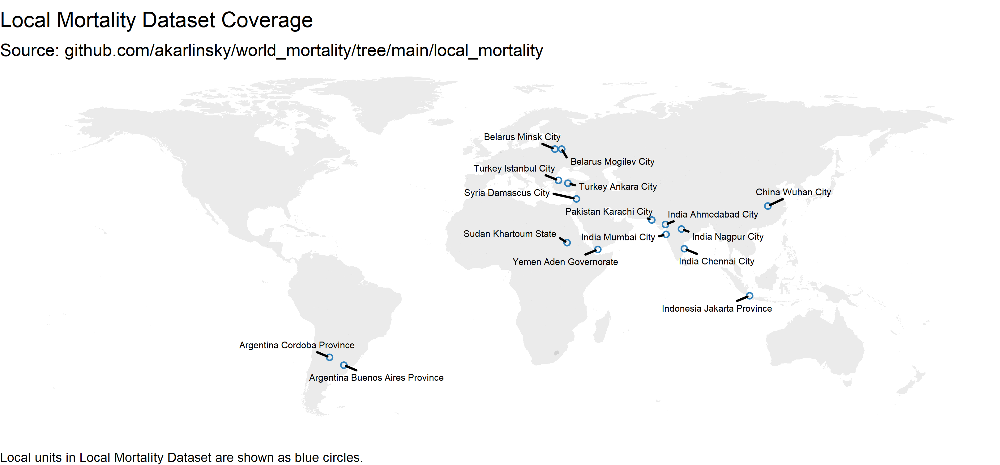
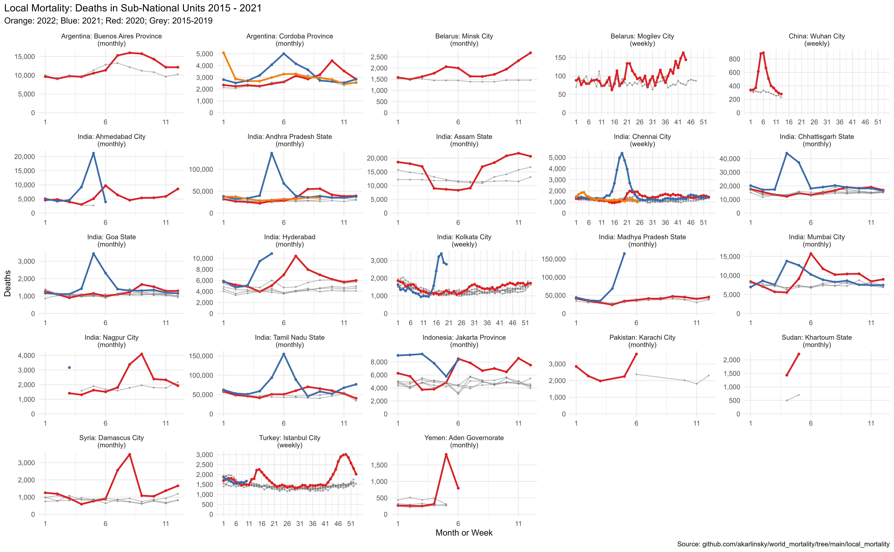

# Local Mortality Dataset

This repository contains local-level data on all-cause mortality in 2015–2021.    
Local is any sub-national unit - whether state, province, region, city etc.   
Local Mortality is a sister-project of [World Mortality](https://github.com/akarlinsky/world_mortality), Priority is given to local mortality information from countries which are not present in World Mortality or have very partial information on World Mortality.   

Sources vary by local unit, see below.   
We are currently providing data for 10 Local Units from 7 Countries.   
We welcome any contributions.   

Notes:

* Many of our sources come from news articles citing just a few data points per local unit - Data is most likely highly incomplete. Use with caution.
* For inclusion, we require at least one data point from 2020 onward and at least one data point prior to 2020.
* We only collect weekly, monthly, or quarterly data. 
* We only provide all-cause mortality numbers, without splitting by age or gender.
* For some Local Units we do not have raw data prior to 2020 but rather a mean or a forecast. We denote this as `year = 0` in the dataset.

## Sources

## Argentina

### Buenos Aires Province (monthly)
https://www.margen.org/pandemia/textos/impacto.pdf

### Cordoba Province (monthly)
2019 to 2021: https://www.lavoz.com.ar/ciudadanos/enero-fue-quinto-mes-consecutivo-con-exceso-de-mortalidad-en-cordoba

## Belarus

### Mogilev City (weekly)
https://docs.google.com/spreadsheets/d/189Xd-j6KNzVmE68hOob78q0KMc3gD7ksnAfCD5-fCtE/edit#gid=0

## China

### Wuhan City (weekly)
https://www.bmj.com/content/372/bmj.n415

## India

### Ahmedabad City
https://www.reuters.com/article/us-health-coronavirus-india-casualties-idUSKBN24311A

### Mumbai City
https://www.indiaspend.com/how-india-could-fill-in-the-blanks-on-excess-mortality/

https://timesofindia.indiatimes.com/city/mumbai/13k-more-deaths-in-city-this-year-between-march-sept/articleshow/78920631.cms

### Nagpur City
https://timesofindia.indiatimes.com/city/nagpur/nov-death-figures-hint-at-undetected-covid-fatalities-in-city/articleshow/79612964.cms

## Indonesia

### Jakarta (monthly)
Jakarta Province Open Data: https://data.jakarta.go.id/organization/dinas-kependudukan-dan-catatan-sipil?q=Kematian&sort=1

## Pakistan

### Karachi (monthly)
https://www.thenews.com.pk/print/645396-766-burials-in-april-lowest-for-kmc-graveyards-in-past-six-months

https://www.bbc.com/urdu/pakistan-53295535

## Turkey

### Istanbul (weekly)
https://github.com/gucluyaman/Excess-mortality-in-Turkey

----------------------------

# Currently unused sources

Here we list some sources for local mortality which we do not use as they only show annual information for example.

## Argentina

### Cordoba Province
https://www.paho.org/es/documentos/documento-exceso-mortalidad-contexto-covid-19-provincia-cordoba-argentina

https://www.cba.gov.ar/wp-content/uploads/2021/03/Exceso-de-Mortalidad-Documento.pdf

## India

### Bangalore State
https://www.thehindu.com/news/national/karnataka/32-increase-in-mortality-rate-in-bengaluru-patil/article32509298.ece

### Mumbai City
https://portal.mcgm.gov.in/irj/portal/anonymous/qlvitalstatsreport

### Kerala City
https://cr.lsgkerala.gov.in/Pages/map.php

