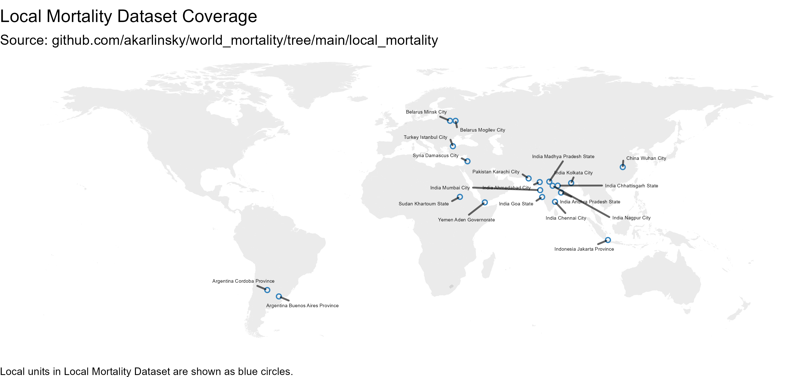

# Local Mortality Dataset

This repository contains local-level data on all-cause mortality in 2015–2021.    
Local is any sub-national unit - whether state, province, region, city etc.   
Local Mortality is a sister-project of [World Mortality](https://github.com/akarlinsky/world_mortality), Priority is given to local mortality information from countries which are not present in World Mortality or have very partial information on World Mortality.   

Sources vary by local unit, see below.   
We are currently providing data for 18 Local Units from 10 Countries.   
We welcome any contributions.   

Notes:

* Many of our sources come from news articles citing just a few data points per local unit - Data is most likely highly incomplete. Use with caution.
* For inclusion, we require at least one data point from 2020 onward and at least one data point prior to 2020.
* We only collect weekly, monthly, or quarterly data. 
* We only provide all-cause mortality numbers, without splitting by age or gender.
* For some Local Units we do not have raw data prior to 2020 but rather a mean or a forecast. We denote this as `year = 0` in the dataset.

## Sources

## Argentina

### Buenos Aires Province (monthly)
https://www.margen.org/pandemia/textos/impacto.pdf

### Cordoba Province (monthly)
2019 to 2021: https://www.lavoz.com.ar/ciudadanos/mortalidad-en-cordoba-ya-lleva-siete-meses-en-exceso/

## Belarus

### Mogilev City (weekly)
https://docs.google.com/spreadsheets/d/189Xd-j6KNzVmE68hOob78q0KMc3gD7ksnAfCD5-fCtE/edit#gid=0

### Minsk City (monthly)
https://carbide-datum-297715.appspot.com/article/2021/04/19/covid-minsk

2015-2019 data was reported as quarterly mean 2015-2019. 
The monthly figures were obtained as the mean of the quarterly figures.

## China

### Wuhan City (weekly)
https://www.bmj.com/content/372/bmj.n415

## India

### Ahmedabad City
https://www.reuters.com/article/us-health-coronavirus-india-casualties-idUSKBN24311A

### Andhra Pradesh State
Andhra Pradesh Civil Registration System, as reported in: https://scroll.in/article/997427/andhra-pradesh-saw-400-increase-in-deaths-in-may-tamil-nadu-saw-more-modest-excess-mortality

Information from [Rukmini S](https://twitter.com/Rukmini).

### Assam State
Assam Civil Registration System, as reported in: https://scroll.in/article/997683/assam-saw-28000-more-deaths-than-normal-in-months-when-first-wave-of-covid-19-struck

Information from [Arunabh Saikia](https://twitter.com/psychia90).

### Chennai City
Daily Registered Deaths in Chennai: https://github.com/elseasama/covid19chennai/tree/gh-pages/chennai_data, a scrape of [Chennai Municipal Corporation data](https://chennaicorporation.gov.in/gcc/online-services/death-certificate/).

Information from [Rukmini S](https://twitter.com/Rukmini).

### Greater Hyderabad
Greater Hyderabad Municipal Corporation death certificates,
As reported in: https://www.thehindu.com/news/cities/Hyderabad/excess-deaths-in-hyderabad-are-10-times-the-official-covid-19-toll-for-telangana/article34807214.ece

Information from Srinivasan Ramani and Vignesh Radhakrishnan.

### Madhya Pradesh State
Madhya Pradesh Civil Registration System, as reported in: https://scroll.in/article/996772/madhya-pradesh-saw-nearly-three-times-more-deaths-than-normal-after-second-wave-of-covid-19-struck

Information from [Rukmini S](https://twitter.com/Rukmini).

### Mumbai City
https://www.indiaspend.com/how-india-could-fill-in-the-blanks-on-excess-mortality/

https://timesofindia.indiatimes.com/city/mumbai/13k-more-deaths-in-city-this-year-between-march-sept/articleshow/78920631.cms

https://timesofindia.indiatimes.com/city/mumbai/excess-deaths-in-city-call-for-scientific-survey-tiss/articleshow/84001199.cms

Information from [Sumitra Debroy](https://twitter.com/debroysumitra).

### Nagpur City
https://timesofindia.indiatimes.com/city/nagpur/nov-death-figures-hint-at-undetected-covid-fatalities-in-city/articleshow/79612964.cms

https://timesofindia.indiatimes.com/city/nagpur/hidden-toll-over-1300-more-deaths-after-covid-routine-fatalities-in-mar/articleshow/82169686.cms

### Kolkata City
https://github.com/thejeshgn/KMCDeathRecords

### Tamil Nadu State
Tamil Nadu Civil Registration System, as reported in: https://www.thehindu.com/news/national/tamil-nadu/excess-deaths-in-tamil-nadu-over-four-times-official-covid-19-tally/article34834150.ece?homepage=true

Information from Srinivasan Ramani and Vignesh Radhakrishnan.

## Indonesia

### Jakarta (monthly)
Jakarta Province Open Data: https://data.jakarta.go.id/organization/dinas-kependudukan-dan-catatan-sipil?q=Kematian&sort=1

## Pakistan

### Karachi (monthly)
https://www.thenews.com.pk/print/645396-766-burials-in-april-lowest-for-kmc-graveyards-in-past-six-months

https://www.bbc.com/urdu/pakistan-53295535

## Sudan

### Khartoum State (monthly)
https://bajnews.net/%D8%A2%D9%84%D8%A7%D9%81%D9%8F-%D9%82%D8%B5%D8%B5-%D8%A7%D9%84%D8%AD%D8%B2%D9%86-%D8%A8%D8%A7%D8%AC-%D9%86%D9%8A%D9%88%D8%B2-%D9%8A%D9%83%D8%B4%D9%81-%D9%81%D9%8A-%D8%AA%D8%AD%D9%82%D9%8A/

[Watson et al. (2020)](https://www.imperial.ac.uk/mrc-global-infectious-disease-analysis/covid-19/report-39-sudan/)

## Syria

### Damascus (monthly)
[Watson et al. (2021)](https://www.nature.com/articles/s41467-021-22474-9).

Watson et al. (2021) provides a host of information on mortality and excess mortality in Damascus. For our purposes, we used the [supplementary table 7](https://github.com/mrc-ide/syria-covid-ascertainment/blob/master/analysis/data/raw/supp_table_7_revised.csv) which collects information on on death certificates postered in Damascus from 2017. To transform these into TOTAL mortality in Damascus, the monthly counts were corrected by the coverage share of certificates (4152) to total deaths reported in Damascus by the Syrian NSO (10835) for 2019.

We advise users to treat this information and estimates with caution. 

## Turkey

### Ankara (weekly) & Istanbul (weekly)
https://github.com/gucluyaman/Excess-mortality-in-Turkey

## Yemen

### Aden Governorate (monthly)
Bin Ghouth (2020) - "Excess deaths within the context of COVID 19 pandemic in Aden in May 2020". 
A published paper based on Bin Ghouth's work is available as [Besson et al. 2021](10.1136/bmjgh-2020-004564)

----------------------------

# Currently unused sources

Here we list some sources for local mortality which we do not use as they only show annual information for example.

## Argentina

### Cordoba Province
https://www.paho.org/es/documentos/documento-exceso-mortalidad-contexto-covid-19-provincia-cordoba-argentina

## India

### Bangalore State
https://www.thehindu.com/news/national/karnataka/32-increase-in-mortality-rate-in-bengaluru-patil/article32509298.ece

### Mumbai City
https://portal.mcgm.gov.in/irj/portal/anonymous/qlvitalstatsreport

### Kerala City
https://cr.lsgkerala.gov.in/Pages/map.php

