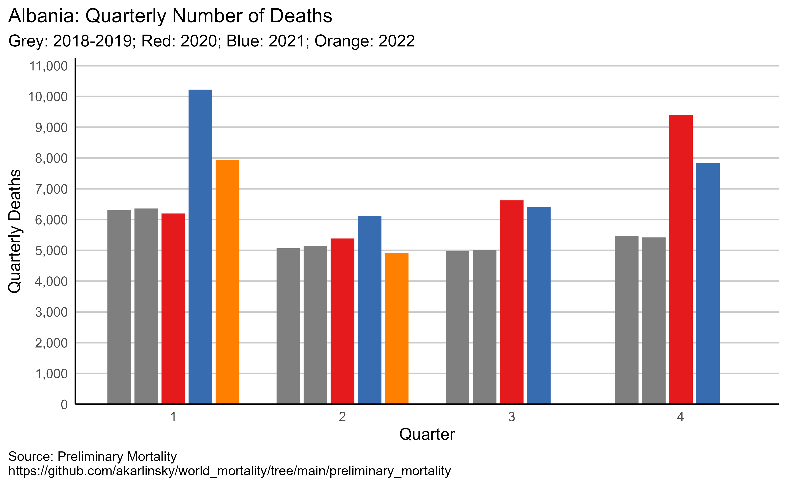
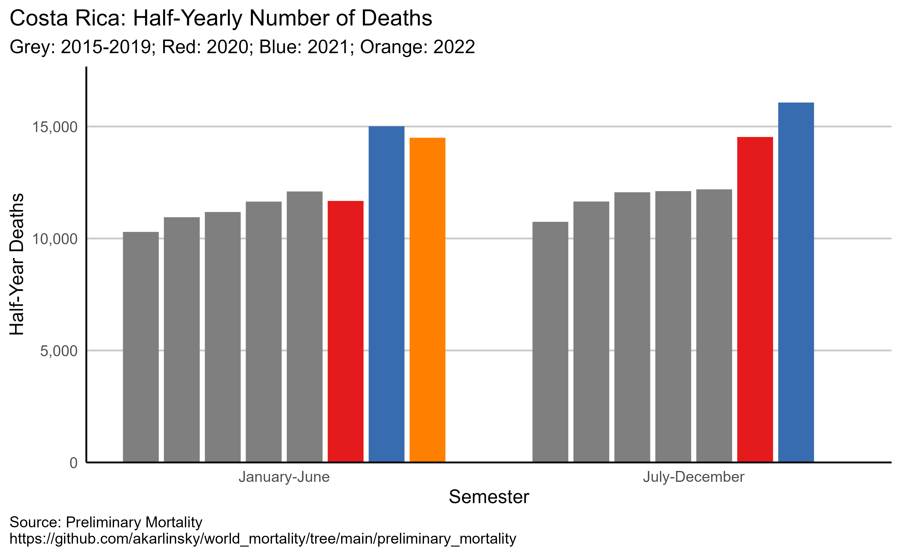
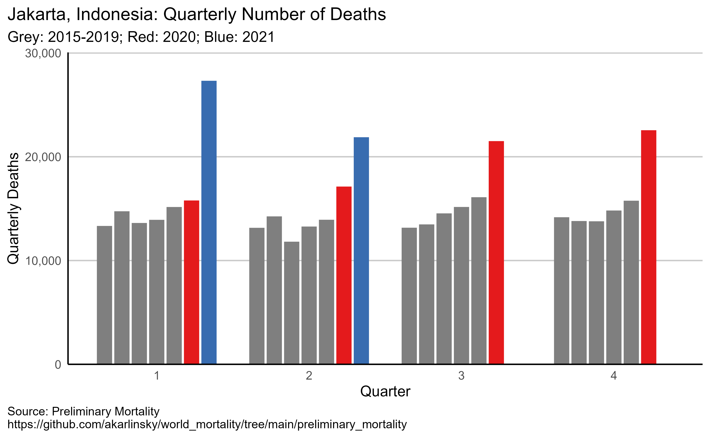
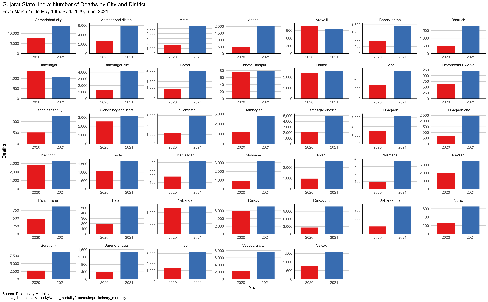
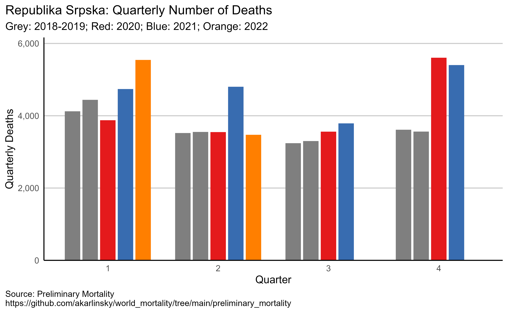
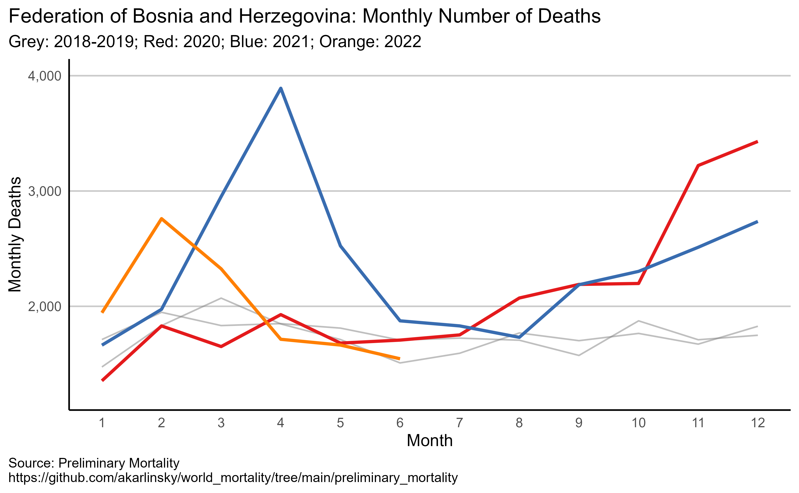
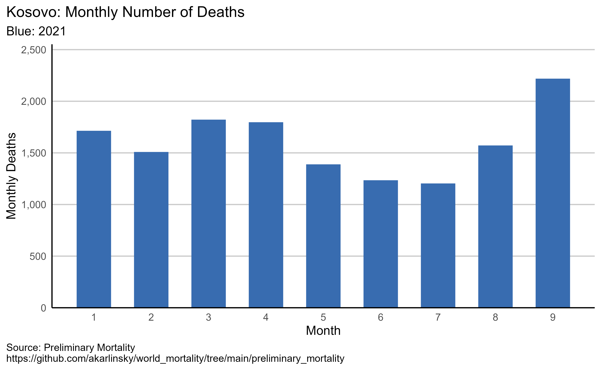
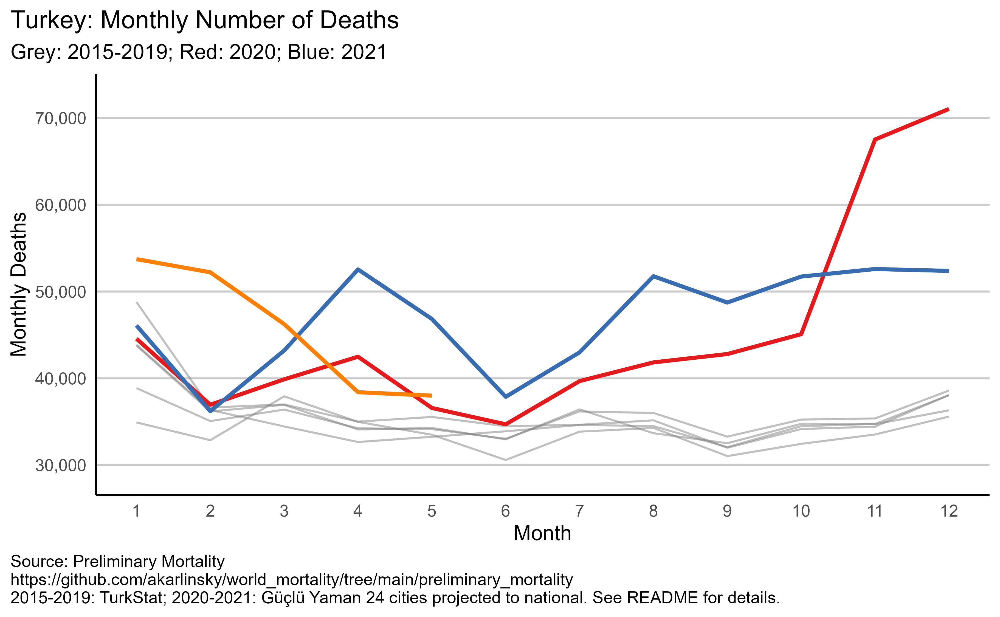
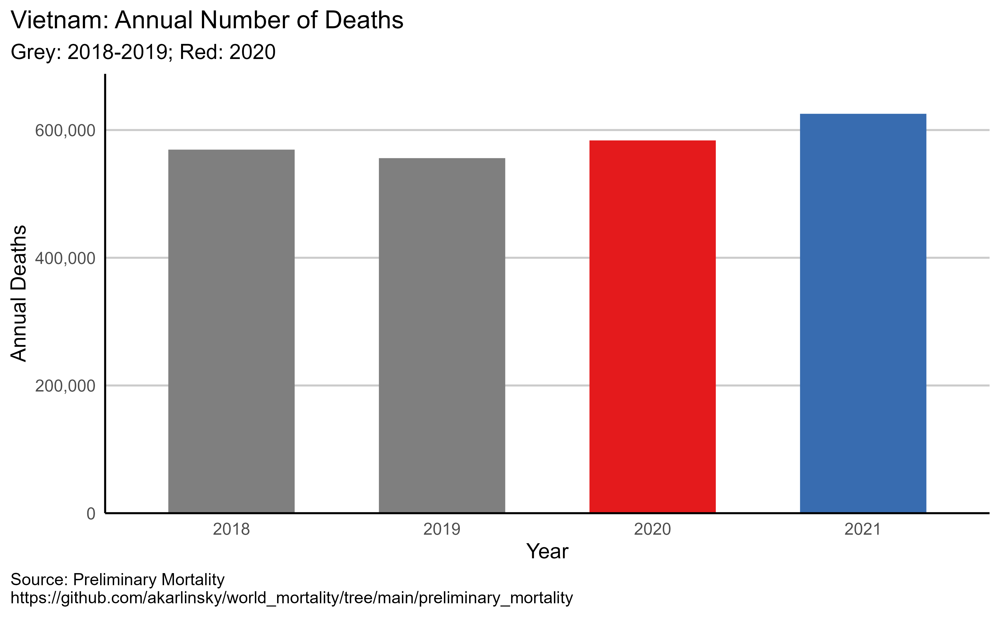

# Preliminary Mortality Dataset

This repository contains preliminary data on all-cause mortality in 2015–2021, which doesn't fit into [World Mortality](https://github.com/akarlinsky/world_mortality) or [Local Mortality](https://github.com/akarlinsky/world_mortality/tree/main/local_mortality) for various reasons such as time format (not weekly, monthly or quarterly), un-official status, projections, early releases of more detailed data forthcoming, etc.
Each datum source, properties and limitations is listed below.
As the time format varies substantially, each source is provided as a separate csv file.

We advise not to use Preliminary Mortality for comparisons and analysis, as we cannot vet the reliability of these reports. It is a collection of disparate all-cause mortality reports from across the world.
 
Sources are listed below the figures. We welcome any contributions.

## Sources

### Albania (Quarterly)
[Albania Institute of Statistics Demographic indicators](http://www.instat.gov.al/en/themes/demography-and-social-indicators/births-deaths-and-marriages/publication/2021/demographic-indicators-q1-2021/).

Monthly counts for Albania are published when available on [World Mortality](https://github.com/akarlinsky/world_mortality). 

### Cities and Districts in Gujarat State, India (March 1st to May 10th)
2020-2021: Divya Bhaskar (Newspaper), translated to English by [Deepak Patel](https://twitter.com/deepakpatel_91/status/1393070596741734405) and [Murad Banaji](https://twitter.com/muradbanaji). 

### Bengaluru City, India (January 1st to July 31st)
2019-2020: https://www.thehindu.com/news/national/karnataka/32-increase-in-mortality-rate-in-bengaluru-patil/article32509298.ece

### Costa Rica (Half-Yearly)
2015-2021: https://www.inec.cr/estadisticas-vitales
Monthly data 2015 to 2020 is on [World Mortality](https://github.com/akarlinsky/world_mortality). Monthly data for 2021 is only expected by March 2022, while data for first half of 2021 already exists. 

### Jakarta, Indonesia (Quarterly)
2015 - 2021
Monthly data 2015 to January 2021 is on [Local Mortality](https://github.com/akarlinsky/world_mortality/tree/main/local_mortality). 

### Tamil Nadu State, India
Removed from Preliminary Mortality, now available on [Local Mortality](https://github.com/akarlinsky/world_mortality/tree/main/local_mortality) by month. 

### Republika Srpska (Quarterly)
One of Bosnia & Herzegovina two autonomous entities.

2019 - 2021: [Republika Srpska Institute of Statistics - Monthly Statsticial Review](https://www.rzs.rs.ba/front/article/4799/)

Total monthly counts for Bosnia & Herzegovina are available at [World Mortality](https://github.com/akarlinsky/world_mortality).

### Federation of Bosnia and Herzegovina (Monthly)
One of Bosnia & Herzegovina two autonomous entities.

2019 - 2021: [Federal Bureau of Statistics of the Federation of Bosnia and Herzegovina - NATURAL POPULATION CHANGE AND MARRIAGES BY MONTHS](http://fzs.ba/index.php/publikacije/saopcenjapriopcenja/stanovnistvo-i-registar/)

Total monthly counts for Bosnia & Herzegovina are available at [World Mortality](https://github.com/akarlinsky/world_mortality).

### Turkey (Monthly)
2015 - 2019: [Turkey Statistical Institute Monthly Deaths](https://biruni.tuik.gov.tr/medas/?kn=114&locale=en)

2020 - 2021: [Güçlü Yaman](https://twitter.com/GucluYaman)'s [collection of all-cause-mortality from 21 cities in Turkey](https://gucluyaman.com/excess-mortality-in-turkey/) which cover about 47% of deaths in Turkey in ordinary times. Monthly total from these cities in 2020-2021 were projected to the entirety of Turkey using the 47% ratio between deaths in 2019. 

### Kuwait (Annual)
[Alahmad, AlMekhled, Odeh & Gasana (2021)](https://www.medrxiv.org/content/10.1101/2021.03.25.21254360v1.full.pdf), obtained from Kuwait
Public Authority for Civil Information.

### Kosovo (Monthly)
2021: Kosovo Agency of Statistics (ASK): [Monthly Bulletin of Vital Statistics](https://ask.rks-gov.net/sq/agjencia-e-statistikave-te-kosoves/add-news/statistikat-e-lindjeve-vdekjeve-kurorezimeve-dhe-shurorezimeve-mars-2021).

The monthly bulletin of vital statistics is consistent with the quarterly bulletin which contains information from 2015 in [World Mortality](https://github.com/akarlinsky/world_mortality). For now, we are separating these two offical counts to avoid consistency issues.

### Vietnam
2018-2020: Vietnam General Statistics Office: [Vietnam Statistical Yearbook](https://www.gso.gov.vn/en/data-and-statistics/2021/07/statistical-yearbook-of-2020/) 
